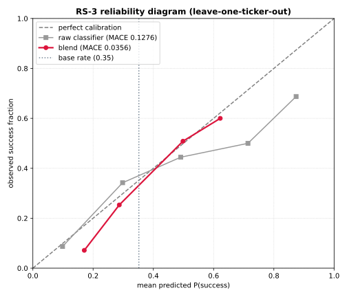
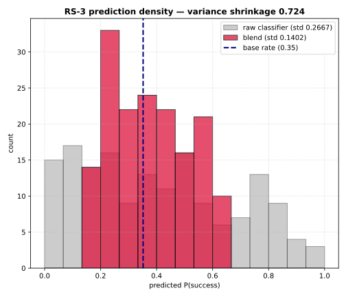

# RS-3 Reliability Diagnostic — true calibration vs. base-rate shrinkage

**Phase 8 · Retry-Success · RS-3 follow-up** · Educational research only; not financial advice.

> **The question.** RS-3's headline is that the classifier↔empirical **blend** clears the trust gate
> with out-of-fold **MACE ≈ 0.036** (vs. the raw classifier's 0.128 and the 0.10 gate). But *how much
> of that 0.036 is genuine calibration* — the model's probabilities being right — *versus the blend
> simply shrinking its predictions toward the historical base rate* until they can't be far wrong?
>
> **The answer, on the real 9-ticker universe: ~87% of the calibration gain is base-rate shrinkage.**
> Only ~13% comes from information the empirical anchor adds beyond pulling predictions to center.

This folder quantifies that decomposition on the **real** leave-one-ticker-out surfaces (not a
simulation), reproduces it as a runnable script, and renders the two diagnostic figures.

---

## 1 · TL;DR

| Surface | AUC (rank) | MACE (calibration) | std (sharpness) | resolution |
|---|---|---|---|---|
| `classifier_raw` | **0.710** | 0.128 ❌ | 0.267 | 0.0406 |
| `empirical_baseline` | 0.490 | 0.185 ❌ | 0.064 | 0.0372 |
| **`blend`** (w=0.5) | **0.702** | **0.036 ✅** | 0.140 | 0.0256 |

- The blend keeps essentially all of the classifier's **ranking** power (AUC 0.710 → 0.702) while
  cutting MACE by **0.092** — that is the calibration "win" RS-3 reported.
- **Decomposition of that 0.092 win:**
  - **0.080 (86.8%)** is reproduced by *mechanically shrinking the raw classifier toward the base rate*
    by the same variance factor, using **zero** empirical information.
  - **0.012 (13.2%)** is the extra calibration the empirical anchor's bucket information actually buys.
- **Variance-shrinkage index = 0.724** — the blend threw away **72%** of the raw classifier's
  prediction variance. Its predictions never leave **[0.17, 0.62]**; the raw classifier spanned
  **[0.10, 0.87]**.
- **Resolution (informative sharpness) fell 0.0406 → 0.0256** — the blend is **demonstrably less sharp**
  than the raw classifier. It bought calibration by hedging, not by fixing feature weights.

**Verdict:** the blend is **honest and safe for portfolio sizing** — its 36% means roughly 36% — but it
is **not a sharper model**. It is a *well-calibrated, deliberately timid* version of the raw classifier.
The original intuition ("roughly half is shrinkage") was directionally right and, on real data,
**conservative** — it's closer to seven-eighths.





---

## 2 · Why this matters

A low MACE is necessary but **not sufficient** for a trustworthy probability. A clock that always reads
the base rate is *perfectly calibrated on average* yet *useless* — it never says anything specific. The
trust gate (AUC ≥ 0.60, MACE ≤ 0.10, n ≥ 50) is designed to prevent that failure (it also requires
discrimination), but it can still **reward shrinkage**: any predictor can lower its MACE by collapsing
toward the base rate, at the cost of sharpness the gate does not directly score.

So before RS-4 surfaces the blend to a sizing consumer, we owe ourselves a clear-eyed answer to: *is the
36% a sharp, feature-driven estimate, or a timid hedge dressed up as calibration?* This diagnostic
answers it — and the answer (mostly a hedge) is **exactly what should be true** given a near-flat
empirical anchor, which is reassuring: the machinery is behaving as the math predicts, and it is honest
about its own timidity.

---

## 3 · Method

All surfaces are the **same leave-one-ticker-out OOF predictions** used by the RS-3 gate
(`success_oof_surfaces`), so nothing here is in-sample-optimistic. The diagnostic lives in
`src/yearline_universe/success_reliability.py` (pure functions, no I/O, unit-tested); the figures and
console print live in this folder's `run_reliability_diagnostic.py`.

### 3.1 Brier (Murphy) decomposition
For each surface we compute `Brier = reliability − resolution + uncertainty`:
- **reliability** — squared gap between predicted prob and observed frequency *within each bin* (lower =
  better calibrated; this is what MACE tracks).
- **resolution** — how far each bin's outcome rate sits from the overall base rate (**higher = more
  informative sharpness**; a flat predictor has resolution 0).
- **uncertainty** — `ȳ(1−ȳ)`, the irreducible base-rate variance (same for every surface).

Resolution is the honest measure of "is this model *saying something*." A calibration win that **also**
drops resolution is a sharpness-for-calibration trade, not a free lunch.

### 3.2 Variance-shrinkage index
`VSI = 1 − var(blend) / var(raw)`. How much of the raw classifier's spread the blend collapsed. 0 = no
shrinkage; 1 = blend is a constant.

### 3.3 Pure-shrinkage counterfactual (the key control)
We build a surface that has **the same variance as the blend** but contains **no empirical information**:

```
p_pure = base_rate + s · (raw − base_rate),   s = sqrt(var_blend / var_raw)
```

This is "take the raw classifier and shrink it toward the base rate until its variance matches the
blend's." If `MACE(p_pure) ≈ MACE(blend)`, then the blend's calibration is *entirely reproducible by
shrinkage alone* — the empirical anchor added nothing but a contraction toward center. The gap
`MACE(p_pure) − MACE(blend)` isolates the empirical anchor's genuine bucket information.

We split the total MACE gain accordingly:
```
total_gain               = MACE(raw)  − MACE(blend)          = 0.0921
gain_from_shrinkage      = MACE(raw)  − MACE(p_pure)         = 0.0799   (86.8%)
gain_from_empirical_info = MACE(p_pure) − MACE(blend)        = 0.0121   (13.2%)
```

---

## 4 · Results (real universe, n = 162, base rate = 0.352)

### 4.1 Shrinkage decomposition

| Quantity | Value | Reading |
|---|---|---|
| `variance_shrinkage_index` | **0.724** | blend discarded 72% of raw variance |
| `var_raw` → `var_blend` | 0.0711 → 0.0196 | spread collapsed by ~3.6× |
| `mace_raw` → `mace_blend` | 0.128 → 0.036 | the headline calibration win (−0.092) |
| `mace_pure_shrink_to_base` | **0.048** | raw, shrunk to base by same variance, **no empirical info** |
| `mace_half_shrink_to_base` | 0.074 | literal "move halfway to base rate" reference |
| `gain_from_shrinkage` | **0.0799** | what pure shrinkage alone buys |
| `gain_from_empirical_information` | **0.0121** | what the empirical anchor adds *on top* |
| **`fraction_of_gain_from_shrinkage`** | **0.868** | **~87% of the calibration win is shrinkage** |
| `resolution_lost_to_shrinkage` | 0.0150 | sharpness traded away (0.0406 → 0.0256) |
| `mean_abs_pull_of_raw_extremes` | 0.139 | avg distance the >0.7 / <0.3 raw preds were dragged to center |

`mace_pure_shrink_to_base (0.048) ≈ mace_blend (0.036)` is the crux: a surface built with **no empirical
data at all** — just the raw classifier contracted toward the base rate — already lands within 0.012 MACE
of the blend. That 0.012 is the entire marginal value of the empirical anchor's bucket structure.

### 4.2 What the figures show

- **Reliability diagram** (`rs3_reliability_diagram.svg`): the blend (crimson) tracks the 45° perfect-
  calibration line tightly across its whole range, while the raw classifier (gray) sits well below the
  line at the high end (predicts ~0.87, observes ~0.69) — classic over-confidence. **But** notice the
  blend's curve only spans **x ∈ [0.17, 0.62]**: it has *no points* in the 0.7–0.9 region where sizing
  decisions would most want a confident signal. Calibrated, yes — but only because it refuses to make
  strong calls.
- **Prediction-density histogram** (`rs3_prediction_histogram.svg`): the shrinkage made visible. The raw
  classifier (gray) has real mass at both tails (0.0–0.1 and 0.8–1.0). The blend (crimson) is squeezed
  into a narrow band hugging the base-rate line (0.35), std 0.267 → 0.140.

---

## 5 · Interpretation for V13

This is **not a defect** — it is the expected behavior of blending a discriminating-but-over-confident
ranker with a **near-flat** empirical anchor (the empirical baseline's std is just 0.064; on this
universe it barely deviates from the base rate). Convex blending with a flat series *is* shrinkage toward
that series' mean. The diagnostic simply confirms the mechanism and measures it honestly.

**Consequences that should shape RS-4 and the sizing stack:**

1. **Trust the sign and the ordering, size on the magnitude cautiously.** The blend's AUC (0.702) says
   its *ranking* is real and survives the unseen-ticker test. Use it to rank/qualify retries. But its
   *level* is deliberately compressed — a blend "0.55" is a genuinely-above-base-rate setup, not a
   "55% sure" call. Sizing curves should be gentle in the blend's probability, never aggressive.
2. **The gate alone is not enough; pair MACE with resolution.** RS-4 should report (and ideally gate on)
   **resolution** alongside MACE, so a future surface can't pass purely by shrinking. A good target:
   *clear the MACE gate **without** resolution falling below the raw classifier's.*
3. **The upgrade path is sharpness, not more calibration.** The 0.012 ceiling on empirical-information
   gain means we will **not** materially improve this by re-tuning the blend weight or the isotonic step.
   Real gains require a **sharper, better-calibrated raw classifier** — i.e. better *features* (the
   macro/regime work in `planner/04_macro_factors_feature_analysis.md`) or more episodes — so the anchor
   has less over-confidence to correct and the blend can keep more variance.
4. **Honesty is the product.** For a research overlay that **must not auto-execute**, a timid-but-honest
   probability is the correct conservative default. We just must *say so*: the surfaced number is
   calibrated-by-shrinkage, safe for sizing, and intentionally under-confident at the extremes.

---

## 5.1 · Follow-up — *should we de-shrink the blend?* (0.8/0.2 or isotonic)

A natural next question: if the 0.5/0.5 blend shrinks so hard, should we move to **0.8 raw + 0.2
empirical** or to an **isotonic** surface to recover sharpness while keeping MACE ≤ 0.10? I tested the
whole blend-weight + isotonic frontier (`analyze_blend_frontier.py`) with an episode-cluster bootstrap.
Short answer: **not yet, and not those settings.**

- **The AUC "alpha" is already in the 0.5 blend** (0.702 vs. raw 0.710) — shrinkage costs ranking almost
  nothing, so there's no alpha to "unlock." What it costs is *resolution*.
- **0.8/0.2 fails the gate** (MACE **0.107**); the sharpest gate-passing blend on current data is **w≈0.7**
  (MACE 0.082, +37% resolution). **Isotonic** either fails (iso-raw MACE 0.103, and its AUC degrades to
  0.679 — a small-sample artifact) or guts discrimination (iso-blend AUC 0.645).
- **No surface — not even the shipped 0.5 — clears the gate with bootstrap margin** on n=162
  (P(MACE ≤ 0.10): 0.84 → 0.35 → 0.19 → 0.04 as you sharpen). "Strictly under 0.10" isn't a property any
  surface has yet; the binding constraint is **sample size**, not the weight.

**Recommendation:** keep 0.5/0.5 shipped; replace the Brier-min blend rule with **"maximize resolution
subject to bootstrap-p95 MACE ≤ 0.10"** (auto-promotes w→0.7→isotonic as data grows); add
leave-one-period-out validation before trusting any sharper surface. Full analysis + frontier figure:
**[`production_adjustment_analysis.md`](production_adjustment_analysis.md)**.

---

## 6 · Reproduce

```bash
# from the repo root
python3 docs/phased_design/phase_08/reliability/run_reliability_diagnostic.py
```

Writes into this folder:
- `rs3_reliability_diagnostic.json` — full per-surface metrics + the `shrinkage` block.
- `rs3_reliability_diagram.svg` — reliability diagram (raw vs. blend vs. perfect calibration).
- `rs3_prediction_histogram.svg` — prediction-density histogram (the shrinkage visualizer).

Unit tests: `tests/test_success_reliability.py` (Brier identity, reliability-curve shape, shrinkage-index
bounds, and the "blend is no sharper than raw" invariant).

---

## 7 · Files

| Path | Role |
|---|---|
| `src/yearline_universe/success_reliability.py` | pure diagnostic (Brier decomp, VSI, pure-shrinkage counterfactual, reliability curves) |
| `src/yearline_universe/success_calibration.py` | exposes `success_oof_surfaces` (shared OOF surfaces) |
| `tests/test_success_reliability.py` | unit tests |
| `docs/phased_design/phase_08/reliability/run_reliability_diagnostic.py` | runnable: real universe → JSON + 2 figures |
| `docs/phased_design/phase_08/reliability/rs3_reliability_diagnostic.json` | results |
| `docs/phased_design/phase_08/reliability/rs3_reliability_diagram.svg` | figure |
| `docs/phased_design/phase_08/reliability/rs3_prediction_histogram.svg` | figure |
| `docs/phased_design/phase_08/reliability/production_adjustment_analysis.md` | §5.1 follow-up: should we de-shrink the blend? (0.8/0.2 / isotonic) |
| `docs/phased_design/phase_08/reliability/analyze_blend_frontier.py` | runnable: blend-weight + isotonic frontier + episode-cluster bootstrap |
| `docs/phased_design/phase_08/reliability/rs3_blend_frontier.{json,csv,svg}` | frontier results + figure |

---

*Capability-before-consumer. All probabilities are leave-one-ticker-out OOF (the deployment-relevant CV).
This engine produces a statistical-context overlay, never trades. Educational research only; not
financial advice.*
