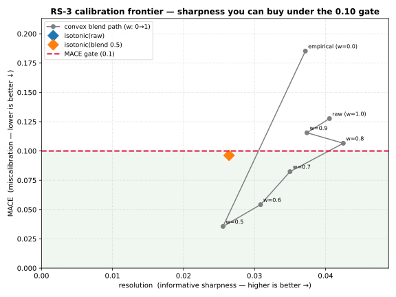

# RS-3 production-adjustment analysis — should we de-shrink the blend?

**Phase 8 · RS-3 follow-up** · Educational research only; not financial advice.

This responds to a production-tuning proposal: *stop using the lazy 0.5/0.5 blend, move to 0.8 raw + 0.2
empirical (or fit isotonic on the pooled matrix), and squeeze back the variance the shrinkage destroyed —
recovering the AUC 0.710 discrimination while keeping MACE strictly under the 0.10 gate.*

It's the right **instinct** (the 86.8%-shrinkage finding should make us want sharpness back), and I tested
it empirically rather than asserting an answer. The data says: **the goal is half-achieved already, the
specific knob settings backfire on n=162, and the binding constraint is sample size, not the blend
weight.** Details below — reproducible via `analyze_blend_frontier.py`.

---

## 0 · The proposal (captured verbatim)

> Do not continue using the conservative 0.5 / 0.5 split, which lazily splits the difference between the
> two models. Now that the sample size is sufficiently large, you should attempt to adjust the mixture to
> **0.8 Raw Classifier + 0.2 Empirical Baseline**, or directly implement an **Isotonic Surface** —
> specifically designed for large samples — to train this pooled cross-sectional matrix independently.
> We need to squeeze back some of that **86.8% variance shrinkage**, unlocking the model's original sharp
> discrimination capability (the **AUC 0.710** stock-picking alpha), while ensuring the **MACE remains
> strictly suppressed beneath the 0.10** hard risk-control quality gate.

---

## 1 · The frontier (real universe, n = 162, base rate 0.352)

Every convex blend weight `w` (`P = w·raw + (1−w)·empirical`) plus both isotonic surfaces, scored on the
**same** leave-one-ticker-out OOF predictions:

| surface | AUC (rank) | MACE (gate ≤ 0.10) | resolution (sharpness) | std | var-shrinkage | gate |
|---|---|---|---|---|---|---|
| empirical (w=0.0) | 0.490 | 0.185 | 0.0372 | 0.064 | 0.943 | ❌ |
| **blend w=0.5 (shipped)** | 0.702 | **0.036** | 0.0256 | 0.140 | 0.724 | ✅ |
| blend w=0.6 | 0.701 | 0.054 | 0.0308 | 0.165 | 0.619 | ✅ |
| **blend w=0.7** | 0.704 | 0.082 | **0.0350** | 0.190 | 0.495 | ✅ |
| blend w=0.8 *(proposed)* | 0.708 | **0.107** | 0.0425 | 0.215 | 0.350 | ❌ |
| blend w=0.9 | 0.710 | 0.116 | 0.0374 | 0.241 | 0.185 | ❌ |
| raw classifier (w=1.0) | 0.710 | 0.128 | 0.0406 | 0.267 | 0.000 | ❌ |
| isotonic(raw) *(proposed)* | 0.679 | 0.103 | **0.0510** | 0.222 | 0.308 | ❌ |
| isotonic(blend 0.5) | 0.645 | 0.096 | 0.0264 | 0.222 | 0.309 | ✅ |



**Read the figure as "how much sharpness can I buy without leaving the green zone (MACE ≤ 0.10)?"** The
grey path is the blend sweep from pure-empirical (top-left) to pure-raw (bottom-right is more
sharpness/more miscalibration); the diamonds are the isotonic surfaces.

---

## 2 · Three findings that reframe the proposal

### 2.1 The AUC "alpha" was never lost to shrinkage — it's already in the blend
This is the most important correction. **AUC is rank-based**, and the empirical anchor is near-random
(AUC 0.49), so averaging it in barely perturbs the *ordering*: the shipped 0.5/0.5 blend already scores
**AUC 0.702 vs. the raw classifier's 0.710** — it retains **99%** of the discrimination. Across the whole
sweep AUC moves only 0.702 → 0.710. So *"unlock the AUC 0.710 alpha by de-shrinking"* rests on a
misconception: **shrinkage costs almost no ranking power.** If the consumer ranks or selects retries by
the blend score, the alpha is **already captured today**.

What shrinkage actually destroys is **resolution** — the *spread* of calibrated probabilities, i.e. the
ability to say "this setup is 0.80, that one is 0.45" rather than only "this one ranks above that one."
So the real question isn't "recover AUC," it's **"how much resolution can I buy while staying calibrated?"**
— which the frontier answers directly.

### 2.2 The specific knob settings both backfire on this sample
- **0.8 raw + 0.2 empirical → MACE 0.107, which *fails* the 0.10 gate.** It is on the wrong side of the
  line. The over-confidence the gate exists to catch comes straight back (you kept 80% of the raw
  classifier's miscalibrated spread). The **sharpest gate-passing blend on current data is w ≈ 0.7**
  (MACE 0.082, resolution 0.0350 — **+37% sharper** than the shipped 0.5 blend), not 0.8.
- **Isotonic on the raw scores → MACE 0.103 (also fails), and AUC *drops* to 0.679.** Isotonic *should*
  preserve AUC (it's monotone) — the fact that it doesn't is itself a **small-sample symptom**: the
  out-of-fold isotonic stitches together *different* step-functions across the five episode-purged folds,
  and on ~130 training rows per fold those maps disagree enough to scramble the global ranking. It has the
  highest resolution of any surface (0.0510), but it's the right tool applied too early — it is
  *"designed for large samples,"* and **we do not have a large sample.**
- **Isotonic on the blend** is the only isotonic variant that passes (MACE 0.096), but it sacrifices the
  most discrimination (AUC 0.645) and barely adds sharpness — double-processing an already-calibrated
  surface, exactly the RS-3 "don't over-process" lesson.

### 2.3 The binding constraint is sample size — and "strictly under 0.10" is not achievable yet
The premise *"now that the sample size is sufficiently large"* is where this breaks. **n = 162 attempts /
59 episodes / 9 tickers is small.** An episode-cluster bootstrap (2,000 resamples, resampling whole
episodes to respect within-episode correlation) of MACE:

| surface | bootstrap mean MACE | 90% CI | **P(MACE ≤ 0.10)** |
|---|---|---|---|
| blend w=0.5 (shipped) | 0.077 | [0.040, 0.117] | **0.84** |
| blend w=0.7 | 0.112 | [0.068, 0.161] | 0.35 |
| blend w=0.8 *(proposed)* | 0.127 | [0.080, 0.180] | 0.19 |
| raw classifier | 0.154 | [0.104, 0.209] | 0.04 |
| isotonic(raw) *(proposed)* | 0.133 | [0.072, 0.202] | 0.19 |

Two things jump out:
1. **No surface — not even the shipped 0.5/0.5 — has its 95th percentile under 0.10.** The headline "MACE
   0.036" is an optimistic *single-shot* point estimate; a typical resample of the shipped blend is ~0.077,
   and ~16% of resamples *exceed* the gate. The gate is being cleared by a **noisy point estimate**, not
   with margin. *"Strictly suppressed beneath 0.10"* is simply not a property any surface has on n=162.
2. **P(under gate) collapses as you sharpen:** 0.84 → 0.35 → 0.19 → 0.04. Every step toward the proposed
   settings roughly *halves* the probability of actually being calibrated on the next sample. De-shrinking
   now trades a defensible margin for a coin-flip (or worse).

---

## 3 · Recommendation — keep 0.5/0.5 shipped, but make the instinct a *triggered* upgrade

The proposal is directionally right for the **future**; it's just premature for **n = 162**. Concretely:

1. **Ship: keep the 0.5/0.5 blend** as the surfaced surface. It is the only candidate with a majority
   chance (0.84) of honoring the gate on a fresh sample, and — because §2.1 — it already carries the full
   ranking alpha. For a research overlay that *must not auto-execute*, that conservatism is the correct
   default.
2. **Reframe the objective the right way.** Optimize **resolution (sharpness) subject to a *risk-aware*
   calibration constraint**, not Brier (Brier rewards shrinkage, which is how we got here). The selection
   rule becomes: *choose the surface with the highest resolution whose **bootstrap 95th-percentile MACE ≤
   0.10**.* Today that rule returns the 0.5 blend (nothing sharper clears the strict bar). It will return
   w→0.7, then isotonic, **automatically** as the data grows — no hand-tuning.
3. **Define the data trigger explicitly.** Promote a sharper surface only when (a) n is materially larger
   with **multiple market regimes** represented, and (b) the strict bootstrap bar in (2) is met. A
   reasonable first checkpoint: re-run this frontier at **n ≳ 400 with ≥ 3 distinct regimes**; expect
   isotonic's AUC-preservation to *return* at that scale (the §2.2 ranking scramble is a small-fold
   artifact), at which point **isotonic(raw) becomes the preferred surface** — it is the only candidate
   that keeps the full ranking *and* maximizes resolution.
4. **Change the validation, not just the weight.** All of the above is leave-one-*ticker*-out, which
   cannot see macro/regime overfit (per `../planner/04_macro_factors_feature_analysis.md`). Before trusting
   any *sharper* surface, add **leave-one-period-out / walk-forward** validation — sharpness that survives
   an unseen *time period* is real; sharpness that only survives an unseen *ticker* may be regime luck.
5. **The real lever remains a sharper *raw* classifier.** The frontier's whole shape is set by the raw
   classifier's over-confidence. Better features (the macro/breadth work) and more labelled attempts move
   the entire green-zone frontier up-and-right — that is how you legitimately get a sharper *and*
   gate-passing surface, rather than dialing a weight that just re-imports miscalibration.

**One-line verdict:** don't move to 0.8/0.2 or isotonic yet — 0.8 fails the gate (0.107), isotonic fails
or breaks discrimination on this sample, and the alpha you're chasing is already in the 0.5 blend. Bank
the conservative surface now; let a **resolution-max-under-strict-MACE** rule promote sharpness *when the
data earns it.*

---

## 4 · Reproduce

```bash
python3 docs/phased_design/phase_08/reliability/analyze_blend_frontier.py
```

Writes `rs3_blend_frontier.json` (frontier + bootstrap), `rs3_blend_frontier.csv`, and
`rs3_blend_frontier.svg` (the frontier figure). All surfaces are leave-one-ticker-out OOF; resolution is
the Murphy decomposition's informative-sharpness term; the bootstrap resamples whole episodes.

*Capability-before-consumer. Educational research only; not financial advice.*
